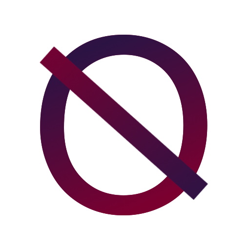
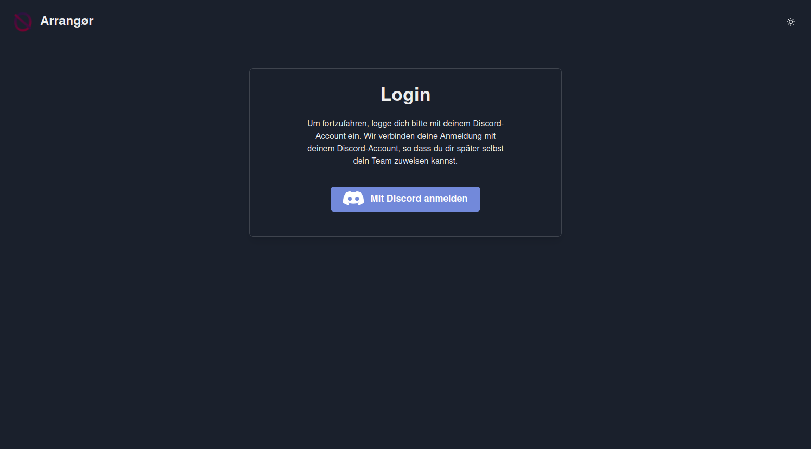
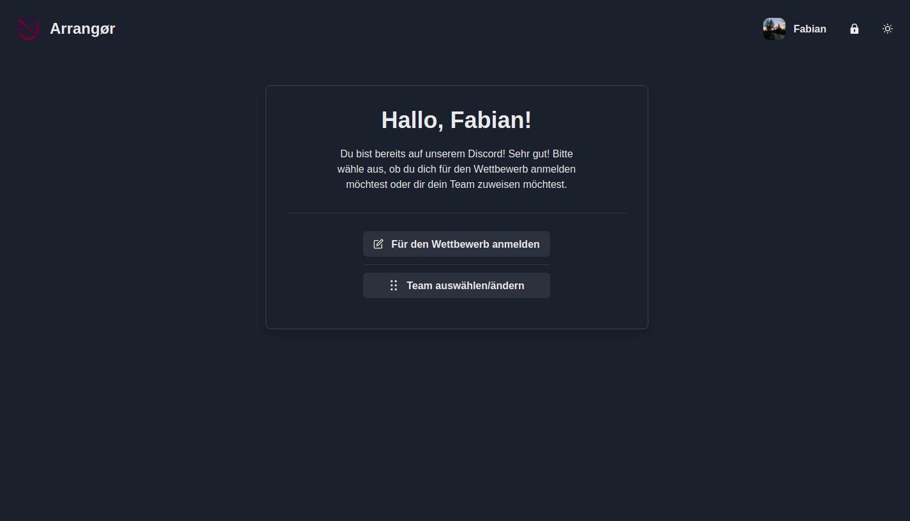
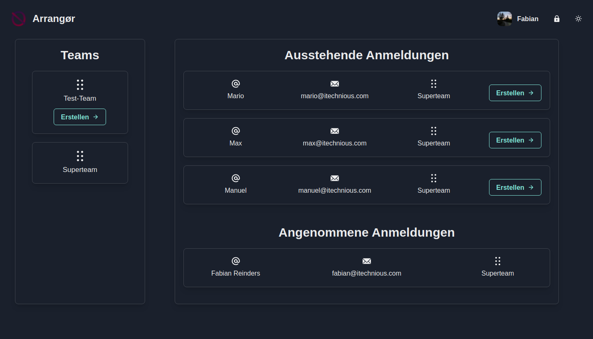
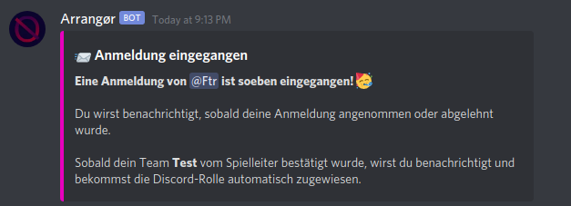
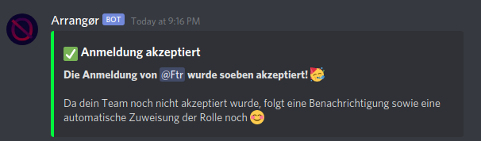
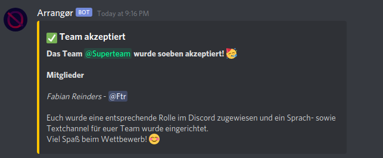
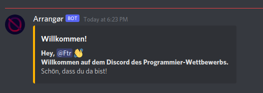
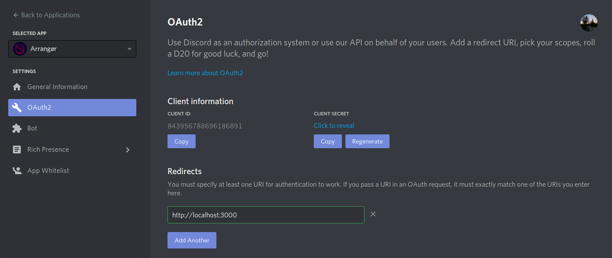

<div align="center">
    
    <hr>
    <h1>Arrangør</h1>
    <strong>
        Ein Discord Bot, der bei der Organisation des Programmier-Wettbewerbs hilft und zahlreiche Automatisierungen sowie ein (Web-) Dashboard bietet. 
    </strong><br><br>
</div>

---

## Funktionen des Bots
### Web-Oberfläche
Die Steuerung des Bots erfolgt hauptäschlich über die Weboberfläche. Es gibt ein Dashboard für Admins, wo Anmeldungen und Teams angenommen, abegelehnt oder verändert werden können und eines, wo sich die Nutzer für den Wettbewerb anmelden oder ihr Team wechseln können.

#### Login mit Discord


#### Dashboard für Nutzer
Wenn man sich anmeldet, erkennt der Bot automatisch, ob man auf dem Hackathon-Server Admin oder normaler Benutzer ist und leitet einen entsprechend entweder an eine Nutzer- oder Adminübersicht weiter.

Auf dem Nutzerdashboard ist es möglich, sich für den Wettbewerb anzumelden oder sein Team zu wechseln.



#### Dashboard für Admins

Wenn eine Anmeldung abgeschickt ist, muss ein Admin sie erst annehmen. Wenn das Team, was in der Anmeldung angegeben wurde noch nicht existiert, wird es automatisch erstellt, aber muss zusätzlich auch nochmal von einem Admin bestätigt werden



#### Discord Benachrichtigungen
Um die von "Quack" eingeführte Tradition der "Rezeption" fortzuführen, hat mein Bot die Möglichkeit, einen Channel für Benachrichtigungen über Anmeldungen, Annahmen oder Teams einzurichten.
##### Anmeldung eingegangen


##### Anmeldung angenommen


##### Team angenommen


#### Begrüßung neuer Nutzer
Der Bot schickt automatisch eine Begrüßung in den Lobby-Channel, wenn ein neuer Nutzer dem Server beitritt.



## Einrichtung / Konfiguration des Bots
### Config-Datei
Der Bot verfügt über eine 'Config-Datei', in die alle Daten eingetragen werden können, die er braucht, um zu funktionieren. Eine ```example.config.yml``` befindet sich im Ordner 'config'. Diese kann einfach kopiert und/oder umbenannt werden zu ```config.yml```. Nachdem dies erledigt ist, muss die Config ausgefüllt werden (siehe Kommentare in der Datei).

Zudem muss in ```web/src/config.js``` noch die URL eingetragen werden, unter der der Bot (bzw. seine API) erreichbar ist.

### Kompilieren des Bots
Der Bot (inklusive seiner API) sind in Go geschrieben und müssen dementsprechend mit dem [Go Compiler](https://golang.org/) kompiliert werden. Den Go Compiler kann man hier herunterladen: https://golang.org/

Mit folgendem Befehl kann man den Bot kompilieren:

```go build cmd/arrangoer/main.go``` 

### Builden der Web-Oberfläche

Die Weboberfläche wurde mit React.js entwickelt und muss entsprechend auch kompiliert bzw. gebuildet werden. 

1. In den Ordner für die Web-Oberfläche gehen

```cd web/```

2. Alle Abhängigkeiten installieren. Dazu müssen [Node.js und npm](https://nodejs.org/en/) installiert sein

```npm install```

3. Die React App "kompilieren" bzw. builden

```npm run build```

Man bekommt einen ```build/``` Ordner, der aus plain HTML und JavaScript Dateien besteht, die man auf jedem erdenklichen Web-Server bereitstellen kann (oder einfach im Browser öffnen).

Web-Oberfläche und Bot dürfen auch auf anderen Ports oder sogar Servern laufen (Einträge in der config.yml und config.js sind zu beachten).

### Woher bekomme ich Client Secret und Client ID?
Den Token, das Client Secret und die Client ID gibt es auf der [Discord Developers Seite](https://discord.com/developers) im OAuth-Menü. Zudem muss dort eine 'redirect uri' eingetragen werden, also eine URL, an die der Nutzer nach dem Login mit Discord weitergeleitet wird. Dort muss die URLder Web-Oberfläche eingetragen werden (wie im Bild zu sehen).



<br>

**Einsendung für den Programmier-Wettbewerb der "Digitalen Woche 2021 Leer" von Fabian Reinders.**